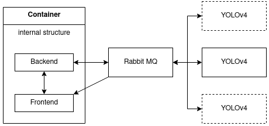

# OpenRemote Object Tracking
Open source implementation of an object tracking algorithm that takes an input of a video source and calculates different parameters from the objects in the frame (people, bikes, cars) then displays the parameters (number of objects, average speed, direction of moving) and sends them to be displayed on the Open Remote manager throw an HTTP API in a Json format.

# demo of the application:
https://www.youtube.com/watch?v=1NQoLWasbcI

# Installation
- Docker
- Nvidia docker containers(linux should work out of the box) 
see: [https://github.com/NVIDIA/nvidia-docker](https://github.com/NVIDIA/nvidia-docker). For windows the support is still experimental on WSL2, so google [windows nvidia docker container](https://www.google.com/search?sxsrf=ALeKk03Mgi6HJgQd0sP4Z4n1oPDGvRcYbg%3A1610718889581&ei=qZ4BYKWDI8KAi-gPwYOj8AY&q=windows+nvidia+docker+container&oq=windows+nvidia+docker+container&gs_lcp=CgZwc3ktYWIQAzIGCAAQCBAeMgYIABAIEB46BAgAEEc6BwgjELACECc6CAgAEAgQBxAeUOYwWI03YNg5aABwAngAgAFgiAHCBJIBATiYAQCgAQGqAQdnd3Mtd2l6yAEFwAEB&sclient=psy-ab&ved=0ahUKEwjl-_u5i57uAhVCwAIHHcHBCG4Q4dUDCAw&uact=5) to find a good tutorial how to set it up.
- docker-compose

# Run
The running of the application is as simple as running:
1. sudo docker-compose build
2. sudo docker-compose up

or you can look for more detailed information of the containers in their respectable subfolders
After that you can open the application at [localhost:3000](http://localhost:3000).

# The containers
## Architecture

* ## frontend
The place where the user interacts with, it's hosted at localhost:3000 (or whatever you configure) and is used to add live streams, and watch the streams.
* ## rabbitmq
The communicationmedium between the containers and the outside world
* ## backend
The backend is responsible for persisting the streams, functionalities of the frontend and auto initialzing of streams on startup. It's written in python.
* ## object detection
The main functionality of the application, the object detection container(s) are the ones which run the object detection algorithm. They are listening to rabbitmq for a start signal at /feed/start/>id<, analyse the frames and stream the resulting frames and data back to rabbitmq.

